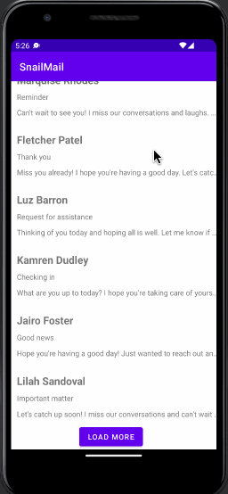

# SnailMail

**SnailMail** is a simple clone of the very popular Gmail app that includes scrolling lists and RecyclerView. The basic version of the app will allow the user to scroll through their emails.

## Required Features

The following **required** functionality is completed:

- [x] User can scroll through a list of 10 emails. Each email includes the following information: Sender, Email title, Email summary

The following **optional** features are implemented:

- [x] The basic version of the app will allow the user to scroll through their emails

The following **additional** features are implemented:

* [x] User can press a 'Load More' button to see the next 5 emails displayed

## Video Walkthrough

Here's a walkthrough of implemented user stories:

<!-- Replace this with whatever GIF tool you used! -->
GIF created with LICEcap 
<!-- Recommended tools:
[Kap](https://getkap.co/) for macOS
[ScreenToGif](https://www.screentogif.com/) for Windows
[peek](https://github.com/phw/peek) for Linux. -->

## License

    Copyright [2022] [Peilin Chen]

    Licensed under the Apache License, Version 2.0 (the "License");
    you may not use this file except in compliance with the License.
    You may obtain a copy of the License at

        http://www.apache.org/licenses/LICENSE-2.0

    Unless required by applicable law or agreed to in writing, software
    distributed under the License is distributed on an "AS IS" BASIS,
    WITHOUT WARRANTIES OR CONDITIONS OF ANY KIND, either express or implied.
    See the License for the specific language governing permissions and
    limitations under the License.
